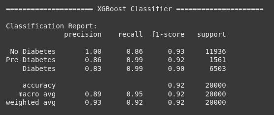

# Laporan Proyek Machine Learning - Genta Haetami Putra

## Kesehatan - Penerapan Model Klasifikasi Machine Learning untuk Memprediksi Tahapan Diabetes Berdasarkan Indikator Kesehatan dan Gaya Hidup

Pemanfaatan machine learning (ML) telah membuka peluang baru untuk deteksi dini dan prediksi proaktif diabetes, sebuah pergeseran penting dari model perawatan reaktif. Berbagai penelitian telah mengeksplorasi beragam algoritma untuk mengklasifikasikan risiko diabetes dengan tingkat keberhasilan yang bervariasi. Model-model klasik seperti Regresi Logistik (Logistic Regression) dan K-Nearest Neighbors (KNN) sering digunakan sebagai titik awal karena interpretabilitas dan implementasinya yang sederhana, di mana beberapa studi menunjukkan Regresi Logistik sebagai salah satu model yang paling efektif (Khanam & Foo, 2021). Studi lain juga telah menerapkan KNN dan Regresi Logistik secara bersamaan untuk mengevaluasi performa dalam prediksi diabetes (Oza & Bokhare, 2022). Pendekatan ini memberikan dasar yang kuat untuk perbandingan dan validasi model yang lebih kompleks.   

Seiring dengan perkembangan teknik ensemble learning, algoritma berbasis gradient boosting seperti XGBoost (Extreme Gradient Boosting) dan LightGBM (Light Gradient Boosting Machine) telah menunjukkan kinerja yang sangat unggul, terutama dalam menangani dataset tabular yang kompleks seperti data medis (Wang et al., 2020). XGBoost secara konsisten menunjukkan akurasi prediktif yang tinggi dan kemampuan generalisasi yang kuat dalam berbagai studi prediksi diabetes, dengan beberapa penelitian melaporkan akurasi mencapai 89% (Torres et al., 2021). Sementara itu, LightGBM menawarkan keunggulan dalam efisiensi komputasi dan kecepatan pelatihan tanpa mengorbankan akurasi, bahkan sering kali mengungguli model lain termasuk XGBoost dalam beberapa skenario (Alpan & G¨uzel, 2024). Oleh karena itu, proyek ini bertujuan untuk melakukan analisis komparatif yang terfokus pada keempat model ini—mulai dari yang fundamental hingga yang canggih—untuk mengidentifikasi arsitektur yang paling akurat dan efisien dalam memprediksi tahapan diabetes berdasarkan indikator kesehatan dan gaya hidup.

Daftar Pustaka:

- Khanam, J. J., & Foo, S. Y. (2021). A comparison of machine learning algorithms for diabetes prediction. ICT Express, 7(4), 432–439.
- Oza, A., & Bokhare, V. (2022). Diabetes prediction using logistic regression and k-nearest neighbour.
- Wang, G., et al. (2020). A new assessment for the risk of type 2 diabetes mellitus using a machine learning method. Applied Sciences, 10(15), 5259.
- Torres, J. M., et al. (2021). A machine learning model for preemptive diagnosis of diabetes. Applied Sciences, 11(9), 1714.
- Alpan, Y. K., & G¨uzel, M. S. (2024). GBDT Models Outperform Traditional Machine Learning and Deep Learning Models on Tabular Medical Datasets. arXiv preprint arXiv:2410.03705.

## Business Understanding

Proyek ini bertujuan untuk mengatasi tantangan dalam deteksi dini tahapan diabetes melalui penerapan model machine learning. Dengan menganalisis berbagai indikator kesehatan dan gaya hidup, model ini diharapkan dapat mengklasifikasikan individu ke dalam kategori 'No Diabetes', 'Pre-Diabetes', atau 'Diabetes'. Proses ini dimulai dengan mengklarifikasi masalah yang ada, menetapkan tujuan yang jelas, dan merumuskan pendekatan solusi yang terukur.

### Problem Statements

Berdasarkan latar belakang, terdapat beberapa tantangan utama yang perlu diatasi dalam upaya prediksi diabetes:

- Banyaknya algoritma machine learning yang tersedia membuat tidak jelas model mana yang menawarkan akurasi prediktif dan keandalan klinis terbaik untuk membedakan tahapan diabetes, terutama dalam mendeteksi kasus 'Pre-Diabetes' yang merupakan tahap kritis untuk intervensi.
- Meskipun banyak faktor risiko diabetes telah diketahui secara umum, tingkat kepentingan relatif dari setiap indikator kesehatan dan gaya hidup dalam model prediktif sering kali tidak terukur. Akibatnya, sulit untuk menentukan faktor mana yang paling signifikan untuk diprioritaskan dalam skrining.
- erdapat ketidakpastian apakah model canggih seperti gradient boosting memberikan peningkatan performa yang signifikan dibandingkan model dasar yang lebih sederhana (seperti Regresi Logistik) untuk membenarkan kompleksitasnya dalam konteks prediksi diabetes.

### Goals

Untuk menjawab pernyataan masalah di atas, tujuan dari proyek ini adalah sebagai berikut:

- Mengembangkan dan mengevaluasi beberapa model klasifikasi untuk mengidentifikasi model dengan performa tertinggi, dengan fokus utama pada metrik F1-Score dan Recall yang tinggi untuk kelas 'Pre-Diabetes' dan 'Diabetes' guna meminimalkan risiko kasus yang terlewat.
- Menganalisis dan menyajikan peringkat fitur-fitur yang paling berpengaruh dalam prediksi tahapan diabetes berdasarkan model terbaik yang dihasilkan.
- Melakukan analisis komparatif yang terukur untuk menunjukkan perbedaan kinerja antara model dasar dan model canggih, sehingga memberikan justifikasi yang kuat untuk pemilihan model akhir.

### Solution statements

Untuk mencapai tujuan tersebut, diajukan pendekatan solusi yang sistematis dan terukur:

- Mengimplementasikan empat algoritma klasifikasi yang berbeda, yang terdiri dari dua model dasar (K-Nearest Neighbors dan Regresi Logistik) dan dua model ensemble canggih (XGBoost dan LightGBM). Performa setiap model akan dievaluasi secara ketat menggunakan metrik Classification Report (Precision, Recall, F1-Score) dan Confusion Matrix untuk memilih kandidat model terbaik.
- Melakukan proses peningkatan pada model terbaik yang terpilih melalui hyperparameter tuning dengan `GridSearchCV` untuk memaksimalkan kinerjanya. Selanjutnya, model yang telah dioptimalkan ini akan digunakan untuk mengekstrak feature importance. Keberhasilan solusi ini akan diukur dari skor F1-Score akhir pada data uji yang belum pernah dilihat sebelumnya.

## Data Understanding

Data yang digunakan dalam proyek ini merupakan dataset komprehensif yang secara total terdiri dari 100.000 baris (catatan pasien) dan 31 kolom (atribut). Dataset ini berisi berbagai atribut terkait demografi, gaya hidup, riwayat medis, dan hasil pengukuran klinis. Sumber data diperoleh dari platform Kaggle dengan judul [Diabetes Health Indicators Dataset](https://www.kaggle.com/datasets/mohankrishnathalla/diabetes-health-indicators-dataset/data).

### Deskripsi Variabel

Variabel-variabel yang terdapat pada dataset ini adalah sebagai berikut:

- `age`: Usia pasien dalam tahun.
- `gender`: Jenis kelamin pasien.
- `ethnicity`: Latar belakang etnis pasien.
- `education_level`: Tingkat pendidikan terakhir pasien.
- `income_level`: Tingkat pendapatan pasien.
- `employment_status`: Status pekerjaan pasien.
- `smoking_status`: Status merokok pasien.
- `alcohol_consumption_per_week`: Jumlah konsumsi alkohol per minggu.
- `physical_activity_minutes_per_week`: Total menit aktivitas fisik per minggu.
- `diet_score`: Skor yang merepresentasikan kualitas diet pasien.
- `sleep_hours_per_day`: Rata-rata jam tidur per hari.
- `screen_time_hours_per_day`: Rata-rata jam menatap layar per hari.
- `family_history_diabetes`: Indikator riwayat diabetes dalam keluarga (0: Tidak, 1: Ya).
- `hypertension_history`: Indikator riwayat hipertensi (0: Tidak, 1: Ya).
- `cardiovascular_history`: Indikator riwayat penyakit kardiovaskular (0: Tidak, 1: Ya).
- `bmi`: Indeks Massa Tubuh (Body Mass Index).
- `waist_to_hip_ratio`: Rasio lingkar pinggang terhadap pinggul.
- `systolic_bp`: Tekanan darah sistolik (mm Hg).
- `diastolic_bp`: Tekanan darah diastolik (mm Hg).
- `heart_rate`: Denyut jantung istirahat (denyut per menit).
- `cholesterol_total`: Kadar kolesterol total (mg/dL).
- `hdl_cholesterol`: Kadar kolesterol HDL (High-Density Lipoprotein) (mg/dL).
- `ldl_cholesterol`: Kadar kolesterol LDL (Low-Density Lipoprotein) (mg/dL).
- `triglycerides`: Kadar trigliserida (mg/dL).
- `glucose_fasting`: Kadar glukosa darah puasa (mg/dL).
- `glucose_postprandial`: Kadar glukosa darah setelah makan (mg/dL).
- `insulin_level`: Kadar insulin (µU/mL).
- `hba1c`: Kadar Hemoglobin A1c (%), indikator kontrol gula darah jangka panjang.
- `diabetes_risk_score`: Skor risiko diabetes yang dihitung sebelumnya.
- `diagnosed_diabetes`: Indikator apakah pasien pernah didiagnosis diabetes (0: Tidak, 1: Ya).
- `diabetes_stage`: (Variabel Target) Tahapan kondisi pasien ('No Diabetes', 'Pre-Diabetes', 'Type 1', 'Type 2', 'Gestational').

### Pemeriksaan Kualitas Data

Sebelum melakukan eksplorasi lebih dalam, langkah fundamental pertama adalah memeriksa kualitas dasar dari dataset. Proses ini mencakup pengecekan data yang hilang (missing values) dan data duplikat.

Hasil pemeriksaan menunjukkan bahwa dataset ini dalam kondisi sangat baik, di mana tidak ditemukan adanya data yang hilang (0 missing values) dan tidak ada baris data yang terduplikasi (0 duplicates). Kualitas data yang bersih ini memungkinkan kita untuk langsung melanjutkan ke tahap analisis tanpa perlu melakukan proses imputasi atau pembersihan data.

### Eksplorasi Data dan Visualisasi

Tahap awal dalam memahami data adalah melakukan Exploratory Data Analysis (EDA). Salah satu fokus utama EDA pada proyek ini adalah untuk memahami distribusi data pada fitur-fitur numerik dan mengidentifikasi keberadaan outliers (pencilan). Outliers adalah data yang memiliki nilai ekstrem dan berpotensi memengaruhi kinerja model. Untuk tujuan ini, visualisasi dengan Box Plot digunakan.

Dari visualisasi di atas, dapat diamati bahwa sebagian besar fitur numerik memiliki sejumlah outliers. Fitur `physical_activity_minutes_per_week` menunjukkan jumlah outliers yang paling signifikan di sisi atas, yang kemungkinan merepresentasikan individu yang sangat aktif. Keberadaan outliers ini menjadi pertimbangan penting untuk tahapan Data Preparation selanjutnya.

Selain visualisasi, dilakukan juga kuantifikasi untuk menghitung jumlah dan persentase outliers secara numerik menggunakan metode Interquartile Range (IQR). Hasilnya mengkonfirmasi bahwa persentase outliers di sebagian besar fitur relatif rendah, umumnya di bawah 1% dari total data. Namun, fitur physical_activity_minutes_per_week menjadi pengecualian yang paling menonjol dengan persentase outliers mencapai 3.20%. Temuan ini memperkuat observasi dari box plot dan menjadi dasar pertimbangan dalam tahap Data Preparation untuk memutuskan strategi penanganan outliers yang tepat.

### Pemeriksaan Kualitas Data

Untuk memahami hubungan linear antara fitur-fitur numerik, dibuat sebuah heatmap korelasi. Analisis ini penting untuk mengidentifikasi adanya multikolinearitas, yaitu kondisi di mana dua atau lebih variabel independen memiliki korelasi yang sangat tinggi. Multikolinearitas dapat mengganggu interpretasi model, terutama pada model linear seperti Regresi Logistik.

Dari heatmap di atas, dapat diamati beberapa korelasi positif yang kuat dan secara klinis dapat dijelaskan. Korelasi tertinggi ditemukan antara `hba1c` dan `glucose_postprandial` (0.93), serta `hba1c` dengan `glucose_fasting` (0.70). Hubungan ini sangat wajar karena HbA1c merupakan cerminan kadar glukosa darah jangka panjang. Selain itu, korelasi kuat juga terlihat antara `waist_to_hip_ratio` dan `bmi` (0.77), yang keduanya merupakan indikator obesitas.

Meskipun terdapat beberapa korelasi yang kuat, hal ini dianggap wajar karena fitur-fitur tersebut mengukur aspek biologis yang saling berkaitan. Karena model utama yang akan dikembangkan adalah model berbasis pohon (XGBoost dan LightGBM) yang tahan terhadap multikolinearitas, maka diputuskan bahwa tidak ada fitur yang perlu dihapus berdasarkan analisis korelasi ini.

## Data Preparation

Tahap Data Preparation merupakan proses krusial untuk mengubah data mentah menjadi format yang bersih, terstruktur, dan siap digunakan untuk pelatihan model machine learning. Berdasarkan temuan pada tahap Data Understanding, beberapa teknik preparasi diterapkan secara berurutan untuk memastikan kualitas dan integritas data.

### Penanganan Outliers

Meskipun hasil EDA menunjukkan adanya outliers pada beberapa fitur numerik, diputuskan untuk tidak menghapus atau mengubahnya. Keputusan ini didasarkan pada dua pertimbangan utama, yaitu:

- Outliers tersebut dianggap sebagai data yang valid dan berpotensi memuat informasi klinis penting (misalnya, individu yang sangat aktif atau memiliki kadar glukosa ekstrem) 
- Model-model ensemble canggih seperti XGBoost dan LightGBM yang menjadi fokus utama proyek ini secara inheren bersifat robust atau tahan terhadap outliers.

### Reklasifikasi Variabel Target

Variabel target asli, `diabetes_stage`, memiliki lima kategori. Untuk menyederhanakan masalah sesuai dengan tujuan proyek, dilakukan reklasifikasi menjadi tiga kategori utama yang merepresentasikan progresi penyakit: 'No Diabetes', 'Pre-Diabetes', dan 'Diabetes'. Kategori 'Type 1', 'Type 2', dan 'Gestational' digabungkan menjadi satu kelas 'Diabetes'.

### Encoding Variabel Kategorikal

Model machine learning memerlukan input dalam format numerik. Oleh karena itu, semua fitur kategorikal diubah menggunakan dua teknik:

- One-Hot Encoding: Diterapkan pada fitur nominal (yang tidak memiliki urutan) seperti `gender`, `ethnicity`, `employment_status`, dan `smoking_status`. Teknik ini mengubah setiap kategori menjadi kolom biner baru untuk menghindari asumsi urutan yang salah oleh model.
- Label Encoding: Diterapkan pada fitur ordinal (yang memiliki urutan) seperti `education_level` dan `income_level`, serta pada variabel target `diabetes_stage` yang telah direklasifikasi. Ini mengubah kategori menjadi nilai numerik berurutan (0, 1, 2).

### Penanganan Data Leakage

Selama analisis awal, teridentifikasi dua fitur yang berpotensi menyebabkan kebocoran data (data leakage), yaitu `diabetes_risk_score` dan `diagnosed_diabetes`. Fitur-fitur ini mengandung informasi yang secara langsung atau tidak langsung berasal dari variabel target (`diabetes_stage`), sehingga dapat menciptakan akurasi model yang sangat tinggi secara artifisial namun tidak realistis. Untuk memastikan model belajar dari prediktor yang valid, kedua fitur ini dihapus dari dataset.

### Pembagian Dataset (Train-Test Split)

Dataset dibagi menjadi dua bagian: 80% untuk data pelatihan (training set) dan 20% untuk data pengujian (testing set). Proses pembagian ini menggunakan teknik stratifikasi pada variabel target. Stratifikasi memastikan bahwa proporsi setiap kelas ('No Diabetes', 'Pre-Diabetes', 'Diabetes') tetap sama di kedua set data, yang sangat penting untuk mendapatkan evaluasi yang adil pada dataset yang tidak seimbang.

### Penskalaan Fitur (Feature Scaling)

Untuk memastikan bahwa fitur dengan skala numerik yang besar tidak mendominasi proses pelatihan model (terutama untuk KNN dan Regresi Logistik), semua fitur numerik diskalakan menggunakan `StandardScaler`. Scaler ini di-fit hanya pada data pelatihan untuk mencegah kebocoran informasi dari data uji, lalu diterapkan untuk mentransformasi baik data pelatihan maupun data pengujian.

## Modeling

Tahap pemodelan adalah inti dari proyek ini, di mana data yang telah dipersiapkan digunakan untuk melatih model machine learning. Pendekatan yang digunakan adalah melakukan analisis komparatif terhadap empat algoritma yang berbeda, mulai dari model dasar hingga model ensemble canggih, untuk menemukan solusi terbaik.

### Algoritma yang Digunakan

Empat algoritma klasifikasi dipilih untuk dievaluasi. Setiap model dilatih menggunakan parameter spesifik, baik yang diatur secara eksplisit maupun yang merupakan pengaturan bawaan (default) dari library `scikit-learn`.

- K-Nearest Neighbors (KNN): Sebuah algoritma non-parametrik sederhana yang mengklasifikasikan data baru berdasarkan mayoritas kelas dari 'tetangga' terdekatnya.
    
    - Kelebihan: Mudah diimplementasikan dan diinterpretasikan.
    - Kekurangan: Sensitif terhadap skala data, komputasi bisa menjadi lambat pada dataset besar, dan performanya menurun jika terdapat banyak fitur yang tidak relevan.
    - Parameter yang Digunakan: 
        - `n_neighbors`: 5
        - `weights`: 'uniform' 
        - `algorithm`: 'auto'

- Regresi Logistik (Logistic Regression): Model linear yang populer untuk masalah klasifikasi biner dan multikelas. Model ini menghitung probabilitas sebuah data masuk ke dalam kelas tertentu.

    - Kelebihan: Efisien secara komputasi, sangat mudah diinterpretasikan, dan memberikan output probabilitas.
    - Kekurangan: Mengasumsikan hubungan linear antara fitur dan log-odds dari target, serta bisa kurang akurat untuk masalah yang kompleks.
    - Parameter yang Digunakan:
        - `multi_class`: 'multinomial'
        - `solver`: 'lbfgs'
        - `max_iter`: 1000
        - `penalty`: 'l2'

- XGBoost (Extreme Gradient Boosting): Sebuah implementasi gradient boosting yang sangat dioptimalkan. Model ini membangun serangkaian decision tree secara sekuensial, di mana setiap pohon baru mencoba memperbaiki kesalahan dari pohon sebelumnya.

    - Kelebihan: Performa prediktif yang sangat tinggi, memiliki regularisasi internal untuk mencegah overfitting, dan fleksibel.
    - Kekurangan: Lebih kompleks untuk di-tuning dan memerlukan lebih banyak sumber daya komputasi dibandingkan model dasar.
    - Parameter yang Digunakan:
        - `use_label_encoder`: False
        - `eval_metric`: 'mlogloss'
        - `random_state`: 42
        - `n_estimators`: 100
        - `learning_rate`: 0.1
        - `max_depth`: 6

- LightGBM (Light Gradient Boosting Machine): Varian lain dari gradient boosting yang menggunakan teknik pertumbuhan pohon berbasis daun (leaf-wise) bukan berbasis level (level-wise) seperti XGBoost.

    - Kelebihan: Kecepatan pelatihan yang sangat tinggi dan penggunaan memori yang lebih efisien, seringkali dengan akurasi yang setara atau bahkan lebih baik dari XGBoost pada dataset besar.
    - Kekurangan: Bisa rentan terhadap overfitting pada dataset kecil jika parameternya tidak di-tuning dengan baik.
    - Parameter yang Digunakan:
        - `n_estimators`: 100
        - `learning_rate`: 0.1
        - `num_leaves`: 31

## Evaluation

Tahap evaluasi bertujuan untuk mengukur performa model final secara objektif pada data yang belum pernah dilihat sebelumnya. Pada tahap ini, model LightGBM yang telah dioptimalkan diuji menggunakan testing set (20% dari total data). Metrik evaluasi yang digunakan dipilih secara saksama agar sesuai dengan konteks masalah klasifikasi medis, di mana konsekuensi dari kesalahan prediksi harus dipertimbangkan.

### Metrik Evaluasi

Metrik utama yang digunakan untuk mengevaluasi model adalah Confusion Matrix beserta turunan-turunannya: Precision, Recall, dan F1-Score.

- Confusion Matrix: Ini adalah tabel yang merangkum hasil prediksi model dengan membandingkannya dengan kelas aktual. Tabel ini menjadi dasar untuk menghitung metrik lainnya dan terdiri dari empat komponen utama:

    - True Positive (TP): Pasien dengan diabetes yang diprediksi benar sebagai penderita diabetes.
    - True Negative (TN): Pasien sehat yang diprediksi benar sebagai sehat.
    - False Positive (FP): Pasien sehat yang salah diprediksi sebagai penderita diabetes (Kesalahan Tipe I).
    - False Negative (FN): Pasien dengan diabetes yang salah diprediksi sebagai sehat (Kesalahan Tipe II). Dalam konteks medis, ini adalah kesalahan paling kritis yang harus diminimalkan.

- Precision: Mengukur tingkat akurasi dari prediksi positif. Metrik ini menjawab pertanyaan: "Dari semua pasien yang diprediksi menderita diabetes, berapa persen yang benar-benar menderita diabetes?"

Precision yang tinggi menunjukkan rendahnya tingkat alarm palsu (false positive).

- Recall (Sensitivity): Mengukur kemampuan model untuk menemukan semua kasus positif yang relevan. Metrik ini menjawab pertanyaan: "Dari semua pasien yang sebenarnya menderita diabetes, berapa persen yang berhasil ditemukan oleh model?"

Recall yang tinggi sangat krusial dalam proyek ini, karena menunjukkan kemampuan model untuk meminimalkan kasus yang terlewat (false negative).

- F1-Score: Merupakan rata-rata harmonik dari Precision dan Recall. Metrik ini memberikan skor tunggal yang menyeimbangkan kedua metrik tersebut, sangat berguna ketika terdapat trade-off antara Precision dan Recall.

### Pemilihan Model Terbaik

Semua model dilatih menggunakan data pelatihan yang telah dipersiapkan. Hasil evaluasi awal menunjukkan bahwa model ensemble (XGBoost dan LightGBM) secara signifikan mengungguli model dasar (KNN dan Regresi Logistik).

Meskipun XGBoost dan LightGBM memiliki skor F1-Score yang identik (0.92), LightGBM dipilih sebagai model final. Keputusan ini didasarkan pada keunggulan kritisnya pada metrik Recall. LightGBM berhasil mencapai Recall sempurna (1.00) untuk kelas 'Pre-Diabetes' dan 'Diabetes', yang berarti model ini mampu mengidentifikasi semua kasus positif tanpa ada yang terlewat. Dalam konteks medis, kemampuan untuk meminimalkan false negatives ini jauh lebih berharga daripada sedikit peningkatan pada metrik lain.

### Peningkatan Model dengan Hyperparameter Tuning

Untuk memaksimalkan potensi LightGBM, dilakukan proses hyperparameter tuning menggunakan `GridSearchCV` dengan validasi silang 5-fold (5-fold cross-validation). Proses ini secara sistematis mencari kombinasi parameter terbaik dari ruang pencarian yang telah ditentukan, dengan tujuan memaksimalkan metrik `f1_weighted`.

Parameter terbaik yang ditemukan adalah sebagai berikut:

- `learning_rate`: 0.01
- `max_depth`: 5
- `n_estimators`: 200
- `num_leaves`: 15

Model akhir yang digunakan adalah model LightGBM dengan konfigurasi parameter optimal ini, yang terbukti memberikan skor F1 cross-validation sebesar 0.9205.

### Analisis Feature Importance

Salah satu output paling berharga dari model berbasis pohon adalah kemampuannya untuk mengukur pentingnya setiap fitur. Analisis feature importance dilakukan pada model LightGBM yang telah dioptimalkan untuk mengidentifikasi prediktor paling signifikan.

Hasil analisis menunjukkan bahwa `glucose_fasting` (gula darah puasa) adalah fitur yang paling berpengaruh, diikuti oleh `age`, `physical_activity_minutes_per_week`, dan `hba1c`. Temuan ini sangat relevan secara klinis dan menegaskan bahwa indikator glikemik dan faktor gaya hidup adalah kunci utama dalam prediksi tahapan diabetes.

### Hasil Evaluasi Final

Berikut adalah laporan klasifikasi (classification report) dari model LightGBM yang telah dioptimalkan saat diuji pada data uji:

Analisis dari hasil evaluasi menunjukkan performa yang sangat memuaskan:

- Performa Keseluruhan: Model mencapai `weighted avg f1-score` sebesar 0.92, yang menandakan bahwa model memiliki keseimbangan yang sangat baik antara Precision dan Recall di ketiga kelas.
- Keunggulan Utama: Poin terpenting dari hasil ini adalah nilai Recall yang sempurna (1.00) untuk kelas 'Pre-Diabetes' dan 'Diabetes'. Ini berarti model berhasil mengidentifikasi SEMUA individu dengan kondisi pre-diabetes dan diabetes di dalam data uji, secara efektif mengeliminasi kesalahan false negative untuk kelas-kelas kritis ini.
- Trade-off yang Dapat Diterima: Untuk mencapai Recall yang sempurna, model mengorbankan sedikit Precision (0.86 untuk Pre-Diabetes dan 0.83 untuk Diabetes). Ini berarti ada beberapa kasus false positive (pasien sehat yang ditandai berisiko). Dalam konteks skrining kesehatan, trade-off ini sangat dapat diterima karena memprioritaskan deteksi semua kasus potensial untuk ditinjau lebih lanjut oleh tenaga medis.

Hasil evaluasi ini juga secara langsung menjawab setiap poin yang telah dirumuskan pada tahap Business Understanding, yaitu:

- Analisis komparatif menunjukkan bahwa LightGBM adalah model dengan keandalan klinis terbaik, dibuktikan dengan kemampuannya mencapai recall 100% pada kelas 'Pre-Diabetes' dan 'Diabetes', yang merupakan tahap kritis untuk intervensi.
- Analisis feature importance dari model LightGBM berhasil mengukur dan menyajikan peringkat faktor paling berpengaruh, dengan `glucose_fasting`, `age`, dan `hba1c` sebagai tiga teratas.
- Hasil evaluasi secara kuantitatif menunjukkan bahwa model gradient boosting (LightGBM dengan F1-score 0.92) memberikan peningkatan performa yang sangat signifikan dibandingkan Regresi Logistik (F1-score 0.82) dan KNN (F1-score 0.71), sehingga membenarkan penggunaannya.
- Model LightGBM berhasil diidentifikasi sebagai yang terbaik setelah evaluasi menyeluruh, dengan fokus pada metrik F1-Score dan Recall yang tinggi untuk kelas-kelas kritis.
- Peringkat fitur-fitur paling berpengaruh berhasil disajikan melalui analisis feature importance.
- Perbandingan kinerja antara model dasar dan canggih telah dilakukan dan didokumentasikan, memberikan justifikasi yang kuat untuk pemilihan model akhir.
- Keempat algoritma telah diimplementasikan, dan evaluasi menggunakan Classification Report dan Confusion Matrix berhasil digunakan untuk memilih kandidat model terbaik.
- Proses hyperparameter tuning pada LightGBM telah dilakukan, dan model yang dioptimalkan telah diinterpretasikan melalui feature importance. Keberhasilan solusi ini divalidasi oleh skor F1-Score akhir sebesar 0.92 pada data uji.

## Kesimpulan

Proyek ini telah berhasil mencapai tujuannya untuk menerapkan dan mengevaluasi model klasifikasi machine learning guna memprediksi tahapan diabetes secara akurat berdasarkan berbagai indikator kesehatan dan gaya hidup. Melalui proses yang sistematis, mulai dari persiapan data hingga optimasi model, sebuah solusi prediktif yang andal telah berhasil dikembangkan.

Berdasarkan analisis komparatif, model LightGBM terpilih sebagai model dengan performa terbaik. Setelah melalui proses hyperparameter tuning, model ini mencapai `weighted avg f1-score` sebesar 0.92 pada data uji. Keunggulan utama dari model ini adalah kemampuannya untuk mencapai recall sempurna (1.00) pada kelas 'Pre-Diabetes' dan 'Diabetes'. Hal ini menunjukkan bahwa model sangat efektif sebagai alat skrining karena mampu mengidentifikasi semua individu yang berisiko tanpa ada kasus yang terlewat, yang merupakan prioritas utama dalam konteks klinis.

Selain itu, analisis feature importance dari model akhir memberikan wawasan yang berharga, mengidentifikasi bahwa `glucose_fasting`, `age`, `hba1c`, dan `physical_activity` adalah faktor-faktor prediktif yang paling signifikan. Temuan ini tidak hanya mengkonfirmasi pengetahuan medis yang ada tetapi juga memberikan justifikasi berbasis data mengenai indikator mana yang harus diprioritaskan dalam upaya deteksi dini diabetes.

Secara keseluruhan, proyek ini menunjukkan bahwa pemanfaatan teknik gradient boosting seperti LightGBM dapat menghasilkan model prediksi tahapan diabetes yang tidak hanya sangat akurat tetapi juga andal secara klinis.

### Keterbatasan dan Pengembangan Selanjutnya

Meskipun model menunjukkan performa tinggi, proyek ini memiliki keterbatasan yaitu hanya menggunakan satu sumber dataset. Untuk pengembangan di masa depan, validasi model pada dataset eksternal dari populasi yang berbeda dapat dilakukan untuk menguji generalisasinya lebih lanjut. Selain itu, implementasi model ke dalam sebuah aplikasi sederhana bisa menjadi langkah berikutnya untuk demonstrasi penggunaan di dunia nyata.